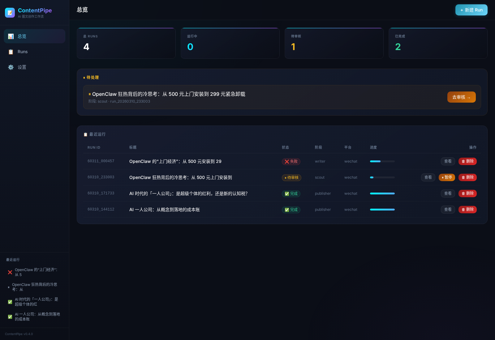
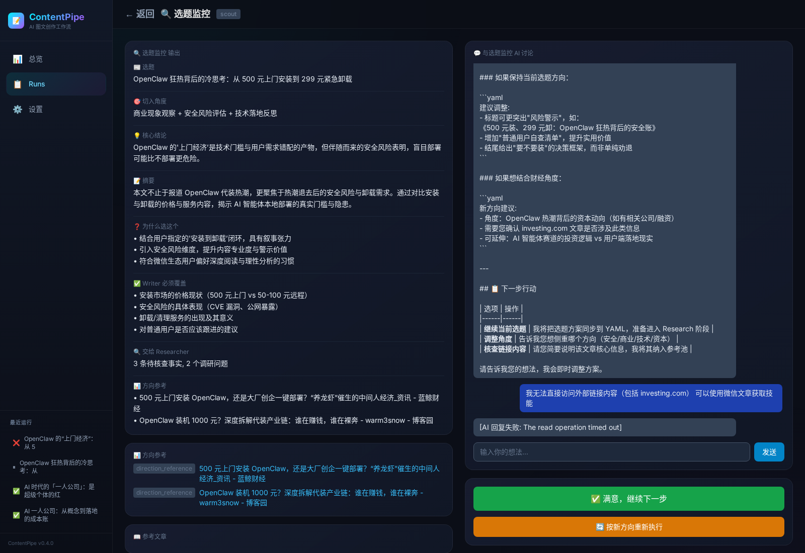
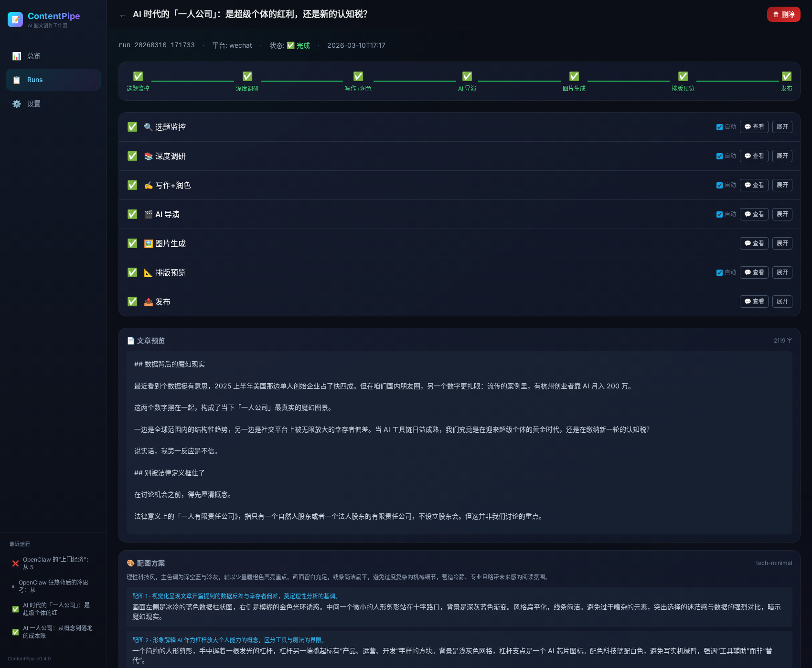

# ContentPipe

> AI 图文内容生产流水线：从选题、调研、写作、配图、排版到发布，全流程可视化、可审核、可回退。

ContentPipe 是一个面向公众号 / 图文平台的内容生产系统。它把一篇内容拆成多个清晰节点：

- **Scout**：选题与切入角度
- **Researcher**：事实核查与证据包
- **Writer**：唯一作者人格（成稿生成 + 审核聊天改稿）
- **Director**：配图规划与视觉风格
- **Image Gen**：生图
- **Formatter**：排版与模板适配
- **Publisher**：发布或导出

每个节点都支持：
- 暂停审核
- 继续对话
- 局部修改
- 重跑当前节点
- 断点续跑

## 界面截图



> 当前 Web 控制台总览页：展示运行统计、待审核任务、最近 runs，以及侧边栏快捷导航。



> Scout（选题监控）审核页：左侧展示结构化选题结果，中间是节点输出卡片，右侧是与 AI 的交互式讨论区，可直接调整选题、角度、摘要和写作要求。



> Run 详情页：展示一篇内容从选题监控、深度调研、写作、AI 导演、图片生成、排版预览到发布的完整 7 节点流水线状态，并可查看文章预览与各阶段产物。

---

## 1. 当前形态

本仓库当前以 **OpenClaw managed-service plugin** 方式组织：

- 插件目录：`plugins/content-pipeline/`
- Web 服务：FastAPI（默认 `http://localhost:8765`）
- LLM 调用：通过 OpenClaw Gateway
- Discord 通知：可选，默认关闭，部署时配置频道 ID

> 说明：仓库内保留了 `SKILL.md`，用于让 OpenClaw agent 理解如何调用/管理这个插件服务；核心运行形态是 **后台服务 + Web 控制台**。

---

## 2. 功能概览

### 2.1 交互式 Pipeline

```text
scout → researcher → writer → director → image_gen → formatter → publisher
```

| 节点 | 作用 | 是否可审核 |
|---|---|---|
| Scout | 热点扫描、选题提案、切入角度、writer brief | ✅ |
| Researcher | 事实核查、数据点、风险与禁写项 | ✅ |
| Writer | 连续主 session 负责写稿/追问/改稿；fresh 结构 LLM 负责整理正文、反 AI 对抗与正式落盘，Python 做最终提交仲裁 | ✅ |
| Director | 规划配图位置、风格、目的、描述 | ✅ |
| Image Gen | 根据规划生成图片 | ⚙️ |
| Formatter | 将 Markdown 转为平台 HTML，并插图 | ✅ |
| Publisher | 公众号 / 小红书导出或发布 | ⚙️ |

> 注：微信公众号发布默认目标是**草稿箱**，不是直接群发。未配置 `WECHAT_APPID` / `WECHAT_SECRET` 时，Publisher 仅本地保存，不会真正调用微信发布接口。

### 2.2 关键特性

- **Per-node session**：每个节点独立会话，执行记录与审核聊天共享上下文
- **逐轮提交仲裁**：每个节点在执行/审核/重试后都要经过 Python 读回正式产物，完成最小提交判定、提交并刷新左侧结果
- **图文精确匹配**：使用 `after_section` 定位，把图片插入指定段落下方
- **模板适配**：支持深色/浅色模板的内联样式输出
- **导向式审核**：在 Web UI 中查看节点输出卡片、文章、配图方案、预览
- **图片管理**：支持替换、删除指定配图，并同步左侧视觉方案
- **服务化运行**：支持健康检查、启动脚本、Discord 通知

---

## 3. 架构

### 3.1 总体结构

```text
OpenClaw Gateway
├─ LLM 请求转发
├─ Discord message API（可选）
└─ blank-agent 路由（contentpipe-blank）

ContentPipe Service (FastAPI)
├─ Web UI（Jinja2 + HTMX）
├─ REST API
├─ SSE 事件推送
├─ Run 状态持久化
└─ Pipeline 节点执行
```

### 3.1.1 blank-agent 执行平面

在 `llm_mode=gateway` 下，ContentPipe 通过一个低污染执行平面来承载节点的正式产物修改：

- Gateway 请求显式路由到 `contentpipe-blank`
- 每个节点保留独立 session key
- 同一个节点的初始执行与后续审核追问共享同一个主 session / 主提示词
- 节点可以直接修改自己的正式产物文件（`edit` 或 `write` 都可以）
- Python 在**每一轮 LLM 运行后**都负责读回正式产物，做最小提交判定、提交、更新 state 与刷新 UI
- 若最小提交判定失败，Python 会把失败反馈送回对应节点继续修复
- 更深层的内容 / schema 校验可作为下一阶段补齐
- Pipeline 下游节点只消费正式产物文件，不依赖聊天解释文字

当前实现状态：
- Scout / Researcher / Director / Formatter 审核聊天已接到“直接修改正式产物 → Python 读回提交”的主链路
- Writer 使用“连续主 session + fresh 结构 helper”模式：主 session 负责改稿，结构 helper 落正式正文

当前正式约定：

- agent id: `contentpipe-blank`
- 安装命令：`./start.sh install-agent`
- 生效命令：`openclaw gateway restart`

### 3.1.2 内置 skill 单源策略

ContentPipe 未来的能力增强（公众号阅读、URL 读取、搜索、发布知识等）统一收口到：

```text
plugins/content-pipeline/skills/
```

原则：
- skill **随插件版本一起发布**
- 不采用“插件内置 + 运行时外装”双轨制
- `contentpipe-blank` 只暴露 ContentPipe 所需的 skill allowlist
- Python pipeline 只保留编排、state、validator、持久化和确定性发布步骤

详细规范见：
- `docs/SKILL-POLICY.md`
- `docs/BUILTIN-SKILLS.md`

当前已内置的最小 skills：
- `contentpipe-wechat-reader`
- `contentpipe-url-reader`
- `contentpipe-web-research`
- `contentpipe-social-research`
- `contentpipe-style-reference`
- `contentpipe-wechat-draft-publisher`

### 3.2 目录结构

```text
content-pipeline/
├─ README.md
├─ SKILL.md
├─ openclaw.plugin.yaml
├─ start.sh
├─ .gitignore
├─ config/
│  ├─ pipeline.yaml
│  ├─ template-mapping.yaml
│  └─ styles/
├─ docs/
│  ├─ ARCHITECTURE.md
│  ├─ schema-scout.yaml
│  ├─ schema-researcher.yaml
│  └─ schema-writer-context.yaml
├─ prompts/
├─ scripts/
│  ├─ nodes.py
│  ├─ tools.py
│  ├─ formatter.py
│  ├─ publisher.py
│  ├─ hot_news.py
│  ├─ jimeng.py
│  ├─ image_engines/
│  └─ web/
│     ├─ app.py
│     ├─ notify.py
│     ├─ events.py
│     ├─ run_manager.py
│     ├─ routes/
│     ├─ templates/
│     └─ static/
├─ templates/
│  └─ wechat/
└─ output/
   └─ runs/
```

### 3.3 状态持久化

每个 run 目录下会保存：

- `state.yaml`
- `topic.yaml`
- `research.yaml`
- `article_draft.md`
- `article_edited.md`
- `visual_plan.json`
- `formatted.html`
- `chat_<node>.json`
- `images/*`

正式产物目录固定为：

```text
plugins/content-pipeline/output/runs/<run_id>/
```

在 blank-agent 模式下，节点最终产物也必须直接写入这条正式路径；**不再兼容**旧的临时/漂移写法（例如 workspace 根下的 `runs/...`）。

默认 `.gitignore` 会忽略 `output/runs/`，避免把运行产物、聊天记录、图片和测试数据提交到公开仓库。

---

## 4. 运行要求

### 4.1 系统依赖

- Python 3.10+
- OpenClaw Gateway
- 可选：Discord channel 配置
- 可选：微信公众号 / 小红书发布配置

### 4.2 Python 依赖

建议使用虚拟环境：

```bash
python3 -m venv .venv
source .venv/bin/activate
pip install fastapi uvicorn sse-starlette python-multipart jinja2 pyyaml httpx
```

如果你打算启用更多能力，还可能需要：

- `playwright`
- `pillow`
- 相关浏览器驱动 / 浏览器 relay 环境

---

## 5. 配置

### 5.1 主配置：`config/pipeline.yaml`

关键字段：

```yaml
pipeline:
  default_platform: "wechat"
  llm_mode: "gateway"   # public/default path
  default_llm: "dashscope/qwen3.5-plus"
  gateway_url: "http://localhost:18789"
  gateway_agent_id: "contentpipe-blank"
  llm_overrides:
    scout: "anthropic/claude-sonnet-4-6"
    researcher: "anthropic/claude-sonnet-4-6"
    writer: "openai-codex/gpt-5.4"
    de_ai_editor: "anthropic/claude-sonnet-4-6"  # 内部 polish
    director: "anthropic/claude-opus-4-6"
    director_refine: "dashscope/qwen3.5-plus"
```

### 5.2 环境变量

常用环境变量：

```bash
OPENCLAW_GATEWAY_URL=http://localhost:18789
CONTENTPIPE_PORT=8765
CONTENTPIPE_HOST=0.0.0.0
CONTENTPIPE_NOTIFY_CHANNEL=<discord_channel_id>
CONTENTPIPE_PUBLIC_BASE_URL=http://localhost:8765
CONTENTPIPE_AUTH_TOKEN=change-me
CONTENTPIPE_LOG_LEVEL=INFO

WECHAT_APPID=...
WECHAT_SECRET=...
OPENAI_API_KEY=...
DASHSCOPE_API_KEY=...
ANTHROPIC_API_KEY=...
```

> ⚠️ 如果你希望 **Publisher 真正把内容创建到微信公众号草稿箱**，必须显式配置环境变量：
> - `WECHAT_APPID`
> - `WECHAT_SECRET`
>
> 同时还需要把当前服务端出口 IP 加入微信公众号后台的 **IP 白名单**，否则会报 `invalid ip ... not in whitelist`。
>
> 如果这两个环境变量未配置，ContentPipe 只能完成本地排版与产物保存，**不会真正发布到任何公众号后台**。

说明：
- `CONTENTPIPE_NOTIFY_CHANNEL` 为空时，不会发送 Discord 通知
- `CONTENTPIPE_PUBLIC_BASE_URL` 用于 Discord 通知里的回链地址
- `CONTENTPIPE_AUTH_TOKEN` 非空时，Web UI / API 会开启鉴权（浏览器登录或请求头 `X-ContentPipe-Token`）
- 发布相关密钥建议只通过环境变量或本地未跟踪配置注入

### 5.3 推荐配置方式（.env.local）

1. 复制示例文件：
   ```bash
   cp .env.example .env.local
   ```

2. 编辑 `.env.local`，填入真实值：
   ```bash
   WECHAT_APPID=wx_your_app_id_here
   WECHAT_SECRET=your_app_secret_here
   ```

3. `start.sh` 会自动加载 `.env.local`

> ⚠️ **安全提醒**：
> - `.env.local` 已加入 `.gitignore`，不会被提交
> - 不要把真实凭证写进 `pipeline.yaml` 或代码
> - 如果凭证已泄露，立即去公众号后台重置 AppSecret

### 5.4 微信公众号发布前置条件

除了配置 `WECHAT_APPID` 和 `WECHAT_SECRET`，还必须：

1. **添加 IP 白名单**
   - 登录公众号后台：`mp.weixin.qq.com`
   - 进入：**设置与开发 → 开发接口管理 → 基本配置 → IP 白名单**
   - 添加当前服务器出口 IP

2. **获取当前出口 IP**
   ```bash
   curl -s https://api.ipify.org
   ```

3. **验证白名单是否生效**
   ```bash
   curl "https://api.weixin.qq.com/cgi-bin/token?grant_type=client_credential&appid=$WECHAT_APPID&secret=$WECHAT_SECRET"
   ```
   - 成功返回：`{"access_token":"...","expires_in":7200}`
   - 失败返回：`{"errcode":40164,"errmsg":"invalid ip ... not in whitelist"}`

---

## 6. 启动方式

### 6.1 使用启动脚本（推荐）

```bash
./start.sh start
./start.sh status
./start.sh logs
./start.sh stop
./start.sh restart
./start.sh install-agent
```

### 6.1.1 一键注册 `contentpipe-blank`（Gateway 模式必做）

如果你要使用 `llm_mode=gateway` 的低污染 blank-agent 执行平面，先运行：

```bash
./start.sh install-agent
openclaw gateway restart
```

这会：
- 创建/修正 `contentpipe-blank`
- 设置独立 `workspace` / `agentDir`
- 将工具权限设为全开（`allow=[]`, `deny=[]`）
- 把插件内置 skills 目录注册到 `skills.load.extraDirs`
- 给 `contentpipe-blank` 写入 ContentPipe 专用 skill allowlist
- 若存在 main agent 的 `auth-profiles.json`，自动复制到 blank agent

默认路径：
- workspace: `~/.openclaw/workspace-contentpipe-blank`
- agentDir: `~/.openclaw/agents/contentpipe-blank/agent`

可通过环境变量覆盖：

```bash
CONTENTPIPE_AGENT_ID=contentpipe-blank \
CONTENTPIPE_AGENT_WORKSPACE=~/.openclaw/workspace-contentpipe-blank \
CONTENTPIPE_AGENT_DIR=~/.openclaw/agents/contentpipe-blank/agent \
CONTENTPIPE_AGENT_MODEL=anthropic-sonnet/claude-sonnet-4-6 \
./start.sh install-agent
```

### 6.1.2 首次部署 Checklist（推荐照着跑）

```bash
cp .env.example .env
# 编辑 .env，至少填 CONTENTPIPE_AUTH_TOKEN / OPENCLAW_GATEWAY_URL

./start.sh install-agent
openclaw gateway restart
./start.sh start
./start.sh status
curl http://127.0.0.1:8765/api/health
```

检查项：
- `CONTENTPIPE_AUTH_TOKEN` 已设置
- OpenClaw Gateway 可访问，且鉴权 token 正常
- `contentpipe-blank` 已创建
- Gateway 已重启，agent 配置已生效
- `http://127.0.0.1:8765/api/health` 返回 healthy

### 6.2 Docker 一键部署（推荐给外部用户）

```bash
cp .env.example .env
# 修改 .env 里的 CONTENTPIPE_AUTH_TOKEN / OPENCLAW_GATEWAY_URL

docker compose up -d --build
```

启动后：
- Web UI: `http://localhost:8765`
- 首次访问会要求输入 `CONTENTPIPE_AUTH_TOKEN`

### 6.3 直接启动 uvicorn

```bash
cd scripts
python3 -m uvicorn web.app:app --host 0.0.0.0 --port 8765
```

### 6.4 健康检查

```bash
curl http://localhost:8765/api/health
curl http://localhost:8765/api/info
```

### 6.4.1 Gateway 模式常见坑

如果你启用了 `llm_mode=gateway`，但发现：

- 节点一直输出解释文字而不是正式 YAML / Markdown / JSON
- blank-agent 没生效
- 刚添加完 `contentpipe-blank` 但运行表现还是老配置

优先检查这几项：

1. 是否已经运行：
   ```bash
   ./start.sh install-agent
   ```
2. 是否已经重启 Gateway：
   ```bash
   openclaw gateway restart
   ```
3. `config/pipeline.yaml` 中是否仍指向：
   - `llm_mode: "gateway"`
   - `gateway_agent_id: "contentpipe-blank"`
4. 正式产物是否落在：
   ```text
   plugins/content-pipeline/output/runs/<run_id>/
   ```

### 6.5 生产部署 / 反向代理 / HTTPS

如果你要把它部署给别人使用，推荐的最小方案是：

1. ContentPipe 只监听内网或 Docker 网络
2. 用 Nginx / Caddy 做反向代理
3. 打开 `CONTENTPIPE_AUTH_TOKEN`
4. 通过 HTTPS 暴露外部访问
5. 把 `CONTENTPIPE_PUBLIC_BASE_URL` 设成最终对外域名

示例（Nginx）：

```nginx
server {
    listen 80;
    server_name contentpipe.example.com;
    return 301 https://$host$request_uri;
}

server {
    listen 443 ssl http2;
    server_name contentpipe.example.com;

    ssl_certificate     /path/to/fullchain.pem;
    ssl_certificate_key /path/to/privkey.pem;

    client_max_body_size 25m;

    location / {
        proxy_pass http://127.0.0.1:8765;
        proxy_set_header Host $host;
        proxy_set_header X-Forwarded-For $proxy_add_x_forwarded_for;
        proxy_set_header X-Forwarded-Proto $scheme;
        proxy_set_header Upgrade $http_upgrade;
        proxy_set_header Connection "upgrade";
    }
}
```

对应 `.env` 建议：

```bash
CONTENTPIPE_AUTH_TOKEN=change-me
CONTENTPIPE_PUBLIC_BASE_URL=https://contentpipe.example.com
OPENCLAW_GATEWAY_URL=http://host.docker.internal:18789
```

如果只在本机使用，可以不配反代和 HTTPS；但**只要要给别人访问，就建议必须开 HTTPS + 鉴权**。

---

## 7. Web UI

主要页面：

- `/`：Dashboard
- `/runs`：运行列表
- `/runs/{run_id}`：运行详情
- `/runs/{run_id}/review?node=scout`：节点审核页
- `/runs/{run_id}/preview`：排版预览
- `/settings`：配置页面

### 7.1 审核页能力

在节点审核页中，你可以：

- 查看结构化卡片
- 与当前节点 AI 对话
- 修改标题 / 切角 / 写法
- 重跑节点
- 在 Director 页面替换 / 删除图片
- 在 Writer 页面直接编辑文章
- 在 Formatter 页面查看最终预览

---

## 8. API 概览

> 📄 **完整 API 文档**: [docs/API.md](docs/API.md)（63 个端点，含请求/响应示例）

### 系统

| 方法 | 路径 | 说明 |
|---|---|---|
| GET | `/api/health` | 健康检查 |
| GET | `/api/info` | 插件信息 |
| GET | `/api/system/status` | 系统全景（Gateway、Run 统计、通知状态） |
| GET | `/api/system/engines` | 图片引擎及可用状态 |
| POST | `/api/system/test-llm` | 测试 LLM 连接 |
| POST | `/api/system/test-notify` | 发送测试通知 |
| GET | `/api/system/logs` | 查看日志 |

### 配置管理

| 方法 | 路径 | 说明 |
|---|---|---|
| GET | `/api/config` | 读取完整配置 |
| PATCH | `/api/config` | 部分更新配置 |
| GET/PUT | `/api/config/models` | 各角色 LLM 模型 |
| GET/PUT | `/api/config/notify` | 通知频道 |
| GET/PUT | `/api/config/image-engine` | 图片引擎 |
| GET/GET/PUT | `/api/config/prompts[/{name}]` | Prompt 管理 |

### Run 管理

| 方法 | 路径 | 说明 |
|---|---|---|
| GET | `/api/runs` | 列出 run |
| POST | `/api/runs` | 创建 run |
| GET | `/api/runs/{id}` | 查看详情 |
| POST | `/api/runs/{id}/start` | 启动 pipeline |
| POST | `/api/runs/{id}/cancel` | 取消执行 |
| DELETE | `/api/runs/{id}` | 删除 run |
| POST | `/api/runs/{id}/clone` | 克隆 run |
| GET | `/api/runs/{id}/timeline` | 执行时间线 |
| POST | `/api/runs/{id}/auto-approve` | 切换全自动模式 |

### 审核 / 交互

| 方法 | 路径 | 说明 |
|---|---|---|
| GET | `/api/runs/{id}/chat/history` | 获取聊天记录 |
| POST | `/api/runs/{id}/chat` | 与当前节点对话 |
| POST | `/api/runs/{id}/review` | 审批继续 |
| POST | `/api/runs/{id}/reject` | 驳回重跑 |
| POST | `/api/runs/{id}/rollback` | 回退到指定节点 |
| POST | `/api/runs/{id}/nodes/{node}/rerun` | 重跑节点 |

### 产物 / 图片

| 方法 | 路径 | 说明 |
|---|---|---|
| GET | `/api/runs/{id}/artifacts` | 列出所有产物文件 |
| GET/PUT | `/api/runs/{id}/artifacts/{file}` | 读取/修改产物 |
| GET/PUT | `/api/runs/{id}/visual-plan` | 导演视觉方案 |
| GET | `/api/runs/{id}/article` | 获取文章 |
| POST | `/api/runs/{id}/images/upload-cover` | 上传封面 |
| POST | `/api/runs/{id}/images/upload-placement` | 上传配图 |
| GET | `/api/runs/{id}/preview/html` | 排版预览 |
| GET | `/api/runs/{id}/diff` | 产物 diff |

### SSE 实时推送

| 方法 | 路径 | 说明 |
|---|---|---|
| GET | `/sse/{id}` | HTMX 事件流 |
| GET | `/api/runs/{id}/events` | JSON SSE（供 Agent 订阅） |

### OpenClaw AI 工具

ContentPipe 注册了 **11 个 AI 工具**，OpenClaw LLM 可直接调用。详见 [docs/API.md #9](docs/API.md#9-openclaw-ai-工具)。

---

## 9. 代码审查结论（当前版本）

在公开前做过一轮仓库级检查，当前需要特别注意：

### 已处理

- ✅ 忽略 `output/runs/` 运行产物
- ✅ 忽略日志、缓存、虚拟环境
- ✅ Discord 通知频道改为环境变量注入，不再硬编码公开仓库默认值
- ✅ Gateway 地址支持环境变量覆盖

### 仍建议后续继续优化

- `scripts/tools.py` / `scripts/publisher.py` 中有部分发布逻辑重复，可进一步收敛
- `scripts/nodes.py` 体积较大，建议未来按节点拆分模块
- 插件清单目前是仓库内的 manifest 文档；如果要做成真正 OpenClaw 原生 TS 扩展，还需要补注册层
- 发布器能力仍偏平台定制，公开 release 前建议补一份最小 demo 配置

---

## 10. 开发说明

### 10.1 本地检查建议

```bash
python3 -m compileall scripts
python3 -m uvicorn web.app:app --host 0.0.0.0 --port 8765
curl http://localhost:8765/api/health
```

### 10.2 推荐提交流程

```bash
git status
git add .
git commit -m "feat: ..."
git push origin main
```

### 10.3 如果你要新接入平台

通常需要改动：

1. `config/pipeline.yaml`
2. `templates/`
3. `formatter.py`
4. `publisher.py`
5. 对应节点 prompt

---

## 11. 路线图

### 已完成

- 交互式多节点 pipeline
- 实时同步（每轮 LLM 运行后都经 Python 读回 / 最小提交判定 / 刷新）
- Writer 三层上下文 + 连续主 session + fresh 结构 LLM
- 图文精确匹配
- Director 配图管理
- 基础插件化（服务清单、健康检查、通知）

### 待完成

- 真正的一键发布链路
- 定时任务 / cron 编排
- 更完整的公开安装流程
- 更多平台模板
- 更细粒度的权限和配置注入

---

## 12. License / 开源配套文件

仓库当前已经补齐以下公开发布基础文件：

- `LICENSE`（MIT）
- `CONTRIBUTING.md`
- `SECURITY.md`

如果你准备正式 release，建议下一步继续补：

- `CHANGELOG.md`
- GitHub Release notes
- 部署示例截图 / demo 数据
